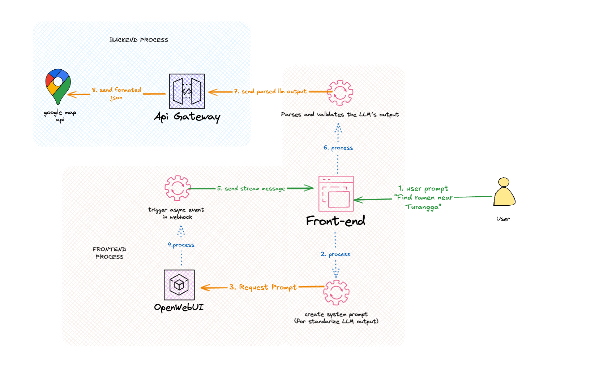

# API Contract Documentation

> **📋 Business Process Documentation**
> This document outlines the business logic and data flow for the AI Location Finder API.
> For complete project overview, see [README.md](../README.md)
> For system architecture, see [Architecture Diagram](./architecture-diagram.png)

## Business Overview

The AI Location Finder API enables intelligent location discovery through natural language processing. The system transforms user queries like "Find ramen near Turangga" into structured location results by leveraging Large Language Models and Google Maps integration.

### Business Flow Reference



## Base URL

- **Development**: `http://localhost:8000`
- **Production**: `https://your-domain.com`

## Response Format

All API responses follow a consistent format:

```json
{
  "success": true,
  "data": {},
  "message": "Success message",
  "timestamp": "2025-09-13T10:30:00Z"
}
```

## Error Format

Error responses follow this structure:

```json
{
  "success": false,
  "error": {
    "code": "ERROR_CODE",
    "message": "Human readable error message",
    "details": {}
  },
  "timestamp": "2025-09-13T10:30:00Z"
}
```

---

## Business Endpoints

### 1. Service Health Check

**GET** `/api/health`

**Business Purpose**: Monitor system availability and service connectivity status for operational reliability.

**Business Case**: Ensures all integrated services (OpenWebUI, Google Maps API) are operational before processing user requests.

#### Request

No parameters required.

#### Response

```json
{
  "success": true,
  "data": {
    "status": "healthy",
    "uptime": 3600,
    "version": "1.0.0",
    "services": {
      "database": "connected",
      "openwebui": "connected",
      "google_maps": "connected"
    }
  },
  "message": "Service is healthy",
  "timestamp": "2025-09-13T10:30:00Z"
}
```

#### Status Codes

- `200` - Service is healthy
- `503` - Service unavailable

---

### 2. Intelligent Location Search

**POST** `/api/search`

**Business Purpose**: Transform natural language queries into actionable location recommendations.

**Business Case**: Core functionality that enables users to find locations using conversational language instead of specific search terms. Supports the main user journey from Step 1-10 in the architecture diagram.

**Business Value**:

- Reduces search complexity for end users
- Increases location discovery accuracy through AI interpretation
- Provides context-aware results based on user intent

#### Request Headers

```http
Content-Type: application/json
```

#### Request Body

```json
{
  "query": "Find ramen near Turangga",
  "location": {
    "lat": -6.2088,
    "lng": 106.8456
  },
  "radius": 5000,
  "limit": 10,
  "preferences": {
    "price_range": "moderate",
    "rating_min": 4.0
  }
}
```

#### Parameters

| Parameter     | Type   | Required | Description                             |
| ------------- | ------ | -------- | --------------------------------------- |
| `query`       | string | Yes      | Natural language search query           |
| `location`    | object | No       | User's current location (lat, lng)      |
| `radius`      | number | No       | Search radius in meters (default: 5000) |
| `limit`       | number | No       | Maximum results to return (default: 10) |
| `preferences` | object | No       | User preferences for filtering          |

#### Response

```json
{
  "success": true,
  "data": {
    "query_processed": "ramen restaurants near Turangga area",
    "locations": [
      {
        "place_id": "ChIJN1t_tDeuEmsRUsoyG83frY4",
        "name": "Ramen Ichiraku",
        "address": "Jl. Turangga No. 123, Bandung",
        "location": {
          "lat": -6.2088,
          "lng": 106.8456
        },
        "rating": 4.5,
        "price_level": 2,
        "photos": [
          "https://maps.googleapis.com/maps/api/place/photo?..."
        ],
        "opening_hours": {
          "open_now": true,
          "periods": [...]
        },
        "distance": 1200,
        "types": ["restaurant", "food", "establishment"]
      }
    ],
    "total_results": 15,
    "search_metadata": {
      "processing_time": 1.2,
      "llm_confidence": 0.85,
      "search_area": "Turangga, Bandung"
    }
  },
  "message": "Search completed successfully",
  "timestamp": "2025-09-13T10:30:00Z"
}
```

#### Status Codes

- `200` - Search successful
- `400` - Invalid request parameters
- `500` - Internal server error

---

### 3. Location Detail Enrichment

**GET** `/api/locations/{place_id}`

**Business Purpose**: Provide comprehensive location information for informed decision-making.

**Business Case**: When users select a location from search results, they need detailed information including hours, reviews, contact details, and photos to make visit decisions.

**Business Value**:

- Enhances user confidence in location selection
- Reduces need for additional research outside the platform
- Supports conversion from discovery to action

#### Parameters

| Parameter  | Type   | Required | Description      |
| ---------- | ------ | -------- | ---------------- |
| `place_id` | string | Yes      | Google Places ID |

#### Query Parameters

| Parameter | Type   | Required | Description                               |
| --------- | ------ | -------- | ----------------------------------------- |
| `fields`  | string | No       | Comma-separated list of fields to include |

#### Response

```json
{
  "success": true,
  "data": {
    "place_id": "ChIJN1t_tDeuEmsRUsoyG83frY4",
    "name": "Ramen Ichiraku",
    "address": "Jl. Turangga No. 123, Bandung",
    "formatted_address": "Jl. Turangga No. 123, Bandung, West Java 40132, Indonesia",
    "location": {
      "lat": -6.2088,
      "lng": 106.8456
    },
    "rating": 4.5,
    "user_ratings_total": 1250,
    "price_level": 2,
    "photos": [
      {
        "photo_reference": "...",
        "height": 1080,
        "width": 1920,
        "html_attributions": ["..."]
      }
    ],
    "opening_hours": {
      "open_now": true,
      "periods": [
        {
          "close": {
            "day": 0,
            "time": "2200"
          },
          "open": {
            "day": 0,
            "time": "1100"
          }
        }
      ],
      "weekday_text": [
        "Monday: 11:00 AM – 10:00 PM",
        "Tuesday: 11:00 AM – 10:00 PM"
      ]
    },
    "reviews": [
      {
        "author_name": "John Doe",
        "rating": 5,
        "text": "Amazing ramen! Best in town.",
        "time": 1694606400
      }
    ],
    "website": "https://ramen-ichiraku.com",
    "phone": "+62 22 1234 5678",
    "types": ["restaurant", "food", "establishment"]
  },
  "message": "Location details retrieved successfully",
  "timestamp": "2025-09-13T10:30:00Z"
}
```

#### Status Codes

- `200` - Location found
- `404` - Location not found
- `500` - Internal server error

---

### 4. Proximity-Based Discovery

**GET** `/api/nearby`

**Business Purpose**: Enable location-based discovery for users exploring specific areas.

**Business Case**: Users often want to explore what's available in their immediate vicinity or around a specific location. This supports spontaneous discovery and location-based recommendations.

**Business Value**:

- Facilitates serendipitous discovery of nearby businesses
- Supports mobile users looking for immediate options
- Enables area-based exploration and planning

#### Query Parameters

| Parameter     | Type    | Required | Description                                |
| ------------- | ------- | -------- | ------------------------------------------ |
| `lat`         | number  | Yes      | Latitude                                   |
| `lng`         | number  | Yes      | Longitude                                  |
| `radius`      | number  | No       | Search radius in meters (default: 1000)    |
| `type`        | string  | No       | Place type (restaurant, gas_station, etc.) |
| `keyword`     | string  | No       | Search keyword                             |
| `min_rating`  | number  | No       | Minimum rating filter                      |
| `price_level` | string  | No       | Price level (1-4)                          |
| `open_now`    | boolean | No       | Only return currently open places          |

#### Example Request

```http
GET /api/nearby?lat=-6.2088&lng=106.8456&radius=2000&type=restaurant&keyword=ramen&min_rating=4.0&open_now=true
```

#### Response

```json
{
  "success": true,
  "data": {
    "results": [
      {
        "place_id": "ChIJN1t_tDeuEmsRUsoyG83frY4",
        "name": "Ramen Ichiraku",
        "vicinity": "Jl. Turangga, Bandung",
        "location": {
          "lat": -6.2088,
          "lng": 106.8456
        },
        "rating": 4.5,
        "price_level": 2,
        "opening_hours": {
          "open_now": true
        },
        "distance": 850,
        "types": ["restaurant", "food"]
      }
    ],
    "next_page_token": "...",
    "search_metadata": {
      "center": {
        "lat": -6.2088,
        "lng": 106.8456
      },
      "radius": 2000,
      "total_results": 25
    }
  },
  "message": "Nearby search completed",
  "timestamp": "2025-09-13T10:30:00Z"
}
```

#### Status Codes

- `200` - Search successful
- `400` - Invalid parameters
- `500` - Internal server error

---

## Business Error Scenarios

| Business Scenario     | Error Code            | Description                                          |
| --------------------- | --------------------- | ---------------------------------------------------- |
| Invalid user input    | `INVALID_REQUEST`     | User provided malformed query or parameters          |
| Location not found    | `NOT_FOUND`           | Requested location doesn't exist in our system       |
| System unavailable    | `INTERNAL_ERROR`      | Temporary service disruption                         |
| External service down | `SERVICE_UNAVAILABLE` | Google Maps API or OpenWebUI temporarily unavailable |
| Invalid coordinates   | `INVALID_LOCATION`    | User provided coordinates outside valid ranges       |
| Query too general     | `QUERY_TOO_BROAD`     | LLM cannot extract specific location intent          |

## Business Use Cases

### Primary Use Cases

1. **Conversational Location Discovery**

   - User: "Find good coffee shops near the university"
   - System: Interprets context, finds relevant locations, returns structured results

2. **Intent-Based Search**

   - User: "Where can I get late night food?"
   - System: Considers time context, finds 24-hour or late-closing restaurants

3. **Area Exploration**

   - User: "What's interesting around Bandung city center?"
   - System: Provides diverse location types for area exploration

4. **Specific Business Discovery**
   - User: "Ramen restaurant with good reviews near Turangga"
   - System: Filters by cuisine type, ratings, and location proximity

### Future Business Capabilities

- **Real-time Location Updates**: Live updates for business hours, availability
- **Personalized Recommendations**: Based on user history and preferences
- **Multi-language Support**: Natural language processing in local languages

## Integration Reference

For complete system setup and configuration, refer to:

- **Project Setup**: [README.md](../README.md)
- **Architecture Overview**: [Architecture Diagram](./architecture-diagram.png)
- **Development Environment**: See installation instructions in README.md

## Business Metrics

The API supports tracking of:

- Query processing success rates
- Location discovery accuracy
- User engagement with results
- Response time performance
- External service reliability
